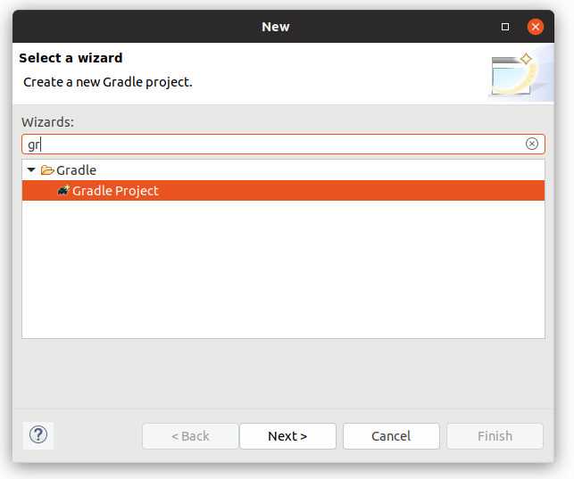
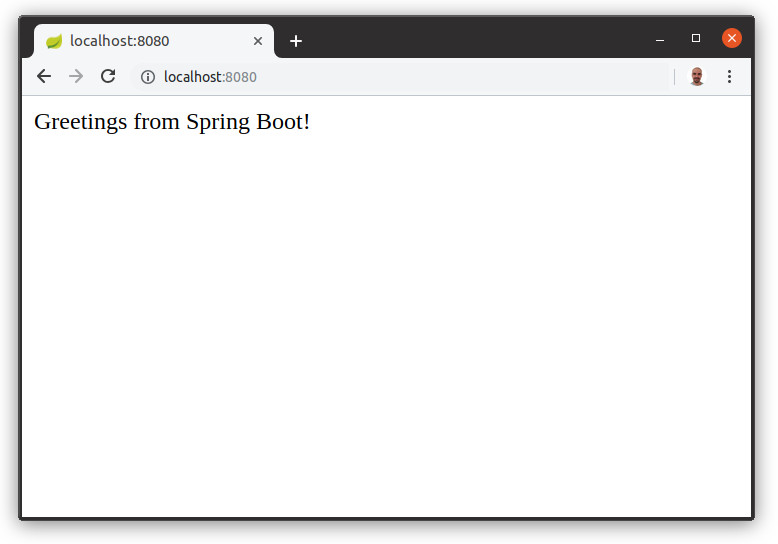

# Spring Boot - Step 01 - Hello Spring Boot!


In this tutorial we are using [Gradle]() as build tool.You could do the same thing with [Maven](), of course, but we find it easier and more intuitive with Gradle, so we are using it by default.


## Initialize Gradle

If using Eclipse, please install the [Buildship Gradle integration](https://projects.eclipse.org/projects/tools.buildship) plugin and create a new Gradle project:

<div style='display: flex; justify-content: center;'>



</div>

It will generate the project structure and initialize Gradle support in Eclipse. It also creates a `build.gradle` that you are going to modify. If you aren't using Eclipse, you can simply create `build.gradle` by hand.

Anyways, you need to modify the `build.gradle` to support Spring Boot. You `build.gradle` should look like this one:

```groovy
buildscript {
   repositories {
       jcenter()
   }
   dependencies {
       classpath 'org.springframework.boot:spring-boot-gradle-plugin:2.1.1.RELEASE'
   }
}

apply plugin: 'java'
apply plugin: 'org.springframework.boot'
apply plugin: 'io.spring.dependency-management'

repositories {
   jcenter()
}

dependencies {
   compile 'org.springframework.boot:spring-boot-starter-web'
}
```

The `buildscript` initializes Spring Boot support on Gradle. Then you're applying two Spring related plugins, one for Spring itself, the other for the dependency manager, i.e. to easily include other Spring dependencies.

And then, as we are creating a REST API, we add `spring-boot-starter-web` as dependency. `spring-boot-starter-web` is a Spring Boot starter for building web, including RESTful, applications using Spring MVC. Uses Tomcat as the default embedded container.

After editing `build.gradle` you refresh your Gradle project and you're ready to do your first Spring application.


## Adding a controller

Now you're creating a simple web controller, a class with the `@RestController` and `@RequestMapping` annotations that provide a way to declare REST endpoints:  

`src/main/java/org.lostinbrittany.cesi.springbeers/HelloController.java`

```java
package org.lostinbrittany.cesi.springbeers;

import org.springframework.web.bind.annotation.RestController;
import org.springframework.web.bind.annotation.RequestMapping;

@RestController
public class HelloController {
   @RequestMapping("/")
   public String index() {
       return "Greetings from Spring Boot!";
   }
}
```
The class is flagged as a `@RestController` annotation, meaning it’s ready for use by Spring MVC to handle web requests. `@RequestMapping` maps `/` to the `index()` method. When invoked from a browser or using `curl` on the command line, the method returns pure text. That’s because` @RestController` combines `@Controller` and `@ResponseBody`, two annotations that results in web requests returning data rather than a view.

## Create an Application class

The `@SpringBootApplication` annotation provides a convenient way to bootstrap a Spring application that will be started from a `main()` method.

```java
package org.lostinbrittany.cesi.springbeers;

import org.springframework.boot.SpringApplication;
import org.springframework.boot.autoconfigure.SpringBootApplication;

@SpringBootApplication
public class SpringBeersBackendApplication {

   public static void main(String[] args) {
       SpringApplication.run(SpringBeersBackendApplication.class, args);
   }
}
```

`@SpringBootApplication` is a convenience annotation that adds all of the following:

- `@Configuration` tags the class as a source of bean definitions for the application context.

- `@EnableAutoConfiguratio`n tells Spring Boot to start adding beans based on classpath settings, other beans, and various property settings.

- `@ComponentScan` tells Spring to look for other components, configurations, and services in the `org.lostinbrittany.cesi.springbeers` package, allowing it to find the controllers.

The `main()` method uses Spring Boot’s `SpringApplication.run()` method to launch an application. Did you notice that there wasn’t a single line of XML? No `web.xml` file either. This web application is 100% pure Java and you didn’t have to deal with configuring any plumbing or infrastructure.

## Run the application

If you are using Eclipse, right click on `SpringBeersBackendApplication.java` on the package explorer, and choose 'Run as Application`. 

In the command line you can simply use Gradle:

```bash
gradle build && java -jar build/libs/spring-beers-0.1.0.jar
```

You should see some output like this:

```shell
  .   ____          _            __ _ _
 /\\ / ___'_ __ _ _(_)_ __  __ _ \ \ \ \
( ( )\___ | '_ | '_| | '_ \/ _` | \ \ \ \
 \\/  ___)| |_)| | | | | || (_| |  ) ) ) )
  '  |____| .__|_| |_|_| |_\__, | / / / /
 =========|_|==============|___/=/_/_/_/
 :: Spring Boot ::        (v2.1.1.RELEASE)

2019-01-07 23:21:01.698  INFO 7879 --- [           main] o.l.c.s.SpringBeersBackendApplication    : Starting SpringBeersBackendApplication on horacio-XPS-13-9360 with PID 7879 (/home/horacio/eclipse-workspace/TestSpringBoot/bin/main started by horacio in /home/horacio/eclipse-workspace/TestSpringBoot)
2019-01-07 23:21:01.714  INFO 7879 --- [           main] o.l.c.s.SpringBeersBackendApplication    : No active profile set, falling back to default profiles: default
2019-01-07 23:21:02.925  INFO 7879 --- [           main] o.s.b.w.embedded.tomcat.TomcatWebServer  : Tomcat initialized with port(s): 8080 (http)
2019-01-07 23:21:02.951  INFO 7879 --- [           main] o.apache.catalina.core.StandardService   : Starting service [Tomcat]
2019-01-07 23:21:02.952  INFO 7879 --- [           main] org.apache.catalina.core.StandardEngine  : Starting Servlet Engine: Apache Tomcat/9.0.13
2019-01-07 23:21:02.962  INFO 7879 --- [           main] o.a.catalina.core.AprLifecycleListener   : The APR based Apache Tomcat Native library which allows optimal performance in production environments was not found on the java.library.path: [/usr/java/packages/lib/amd64:/usr/lib64:/lib64:/lib:/usr/lib]
2019-01-07 23:21:03.050  INFO 7879 --- [           main] o.a.c.c.C.[Tomcat].[localhost].[/]       : Initializing Spring embedded WebApplicationContext
2019-01-07 23:21:03.050  INFO 7879 --- [           main] o.s.web.context.ContextLoader            : Root WebApplicationContext: initialization completed in 1256 ms
2019-01-07 23:21:03.408  INFO 7879 --- [           main] o.s.s.concurrent.ThreadPoolTaskExecutor  : Initializing ExecutorService 'applicationTaskExecutor'
2019-01-07 23:21:03.648  INFO 7879 --- [           main] o.s.b.w.embedded.tomcat.TomcatWebServer  : Tomcat started on port(s): 8080 (http) with context path ''
2019-01-07 23:21:03.660  INFO 7879 --- [           main] o.l.c.s.SpringBeersBackendApplication    : Started SpringBeersBackendApplication in 2.348 seconds (JVM running for 2.92)
2019-01-07 23:21:14.322  INFO 7879 --- [nio-8080-exec-1] o.a.c.c.C.[Tomcat].[localhost].[/]       : Initializing Spring DispatcherServlet 'dispatcherServlet'
2019-01-07 23:21:14.323  INFO 7879 --- [nio-8080-exec-1] o.s.web.servlet.DispatcherServlet        : Initializing Servlet 'dispatcherServlet'
2019-01-07 23:21:14.455  INFO 7879 --- [nio-8080-exec-1] o.s.web.servlet.DispatcherServlet        : Completed initialization in 132 ms
```

You have now your first Spring application running on `localhost:8080`.  You cans test it using `curl`, or via the browser.


```
$ curl localhost:8080
Greetings from Spring Boot!
```





In the [next step](../step-02) you're going to define some routes in your API for the beer list and the beer detail. 