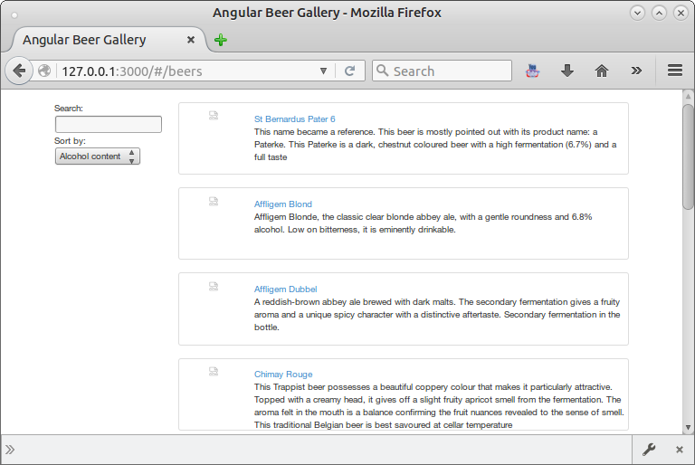
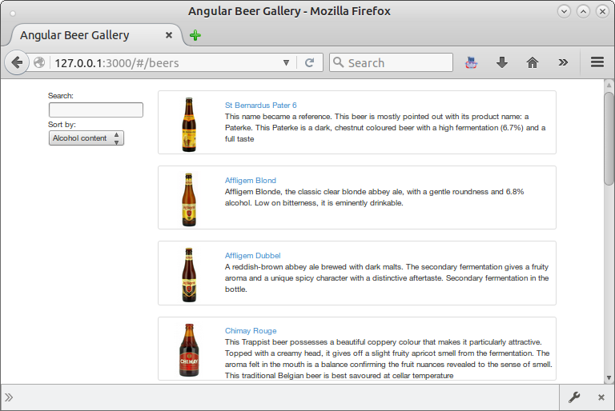

# Step 05 - Serving the webapp


## Getting the webapp files

Serving [static content with Spring Boot](https://spring.io/blog/2013/12/19/serving-static-web-content-with-spring-boot) is truly simple: Spring Boot will automatically add static web resources located within any of the following directories:

- `/META-INF/resources/`
- `/resources/`
- `/static/`
- `/public/`

Now we need to copy the `xxxx-beers` frontend web application into the `public` folder of your app.

If you don't have a `xxxx-beers` frontend, we have put a working version of the frontend in the `/frontend` folder in the repository. 


## Modify the webapp to call the server

You should modify the network calls from the webapp to call our new server instead of simply requesting the JSON files.

In the AngularJS example we have deployed on `/frontend`, that means modifying the controllers of Angular Beers 

```js
angular
  .module('BeerControllers', [])
  .controller('BeerListCtrl', ['$scope', '$http', function($scope, $http) {

    $http.get('beers').success(function(data) {
      $scope.beers = data;
    });

    $scope.orderProp = 'alcohol';
  }])
  .controller('BeerDetailCtrl', ['$scope', '$routeParams', '$http', function($scope, $routeParams, $http) {
    $http.get('beer/' + $routeParams.beerId).success(function(data) {
      $scope.beer = data;      
      $scope.mainImg = $scope.beer.img;

      $scope.setImage = function(img) {
        $scope.mainImg = img;
      }
    });
  }]);
```



Don't forget to remove the `HelloController.java` controller from the first step, as it will kidnap the `/` route.

## Where are my pics?

We still have a problem with the images' path. We could correct it by modifying the JSON... but let's do it in
a more *Spring-y* way, by putting the images from `/data/img` in the `public/img` folder of your application.



In [next step](../step-06) we are going to put the data in a MongoDB database...